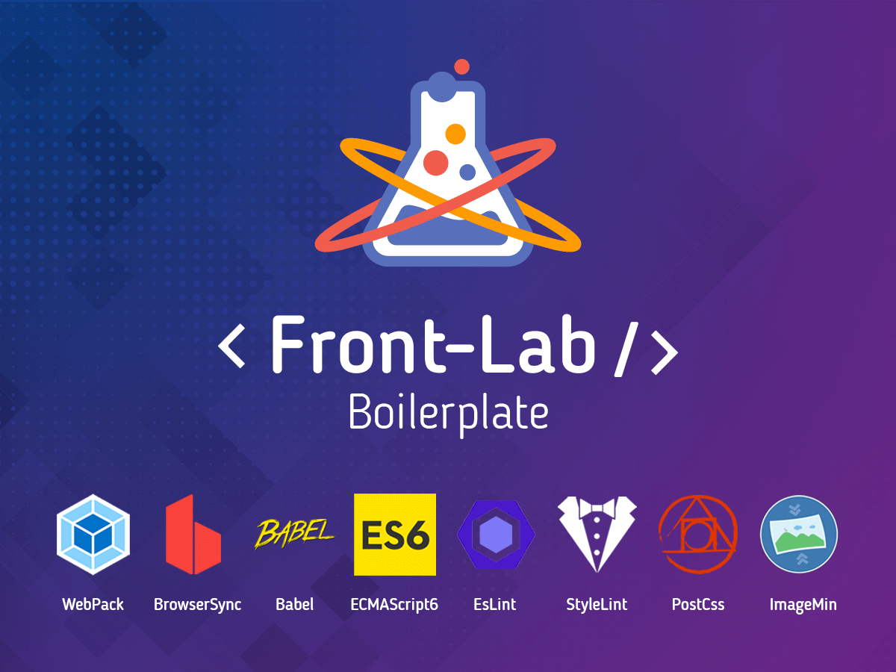

# Front-Lab Boilerplate



## Built With

* [WebPack](https://webpack.js.org)
* [WebpackDevServer](https://webpack.js.org/configuration/dev-server/) with HMR (hot-reload)
* [BrowserSync](https://browsersync.io)
* [Babel](https://babeljs.io)
* [EsLint](https://eslint.org/)
* [StyleLint](https://stylelint.io/)
* [PostCss](https://postcss.org/) (autoprefixer + cssnano)
* [ImageMin](https://github.com/imagemin/imagemin)
* [Sass](https://sass-lang.com/) integration
* [VueJs](https://vuejs.org/) integration

## Features

* Modern Javascript syntax with ES6 via Babel
* Module bundler via Webpack
* Dev Server with Hot-reload
* Bundle Analyzer
* Global Vertical Rhythm
* Dev-Tools native Component
* Basics Components Styles
* Atomic Design architecture

### Development Features

* WebpackDevServer + HMR
* BrowserSync Proxy (port: 8888)
* EsLint + StyleLint
* Css Extract + hot-reload
* Bundle Analyzer - localhost:4000

### Built Features

* EsLint + StyleLint
* Js Minification
* PostCss (autoprefixer + cssnano)
* Css Extract
* Image Compression

## Usage

* Install:
```
npm install
```

* Run dev server (localhost:3000):
```
npm run dev
```

* Build:
```
npm run build
```
